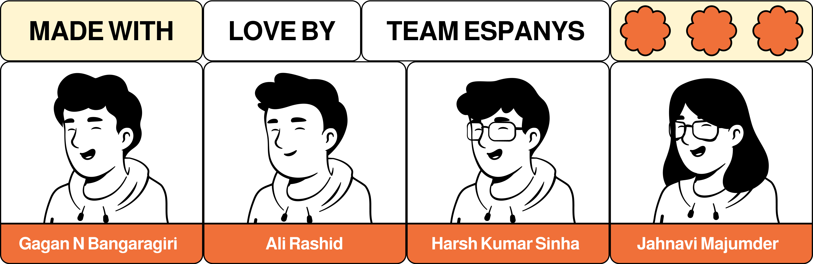

<div align="center">
  
  
  # Flux: AI-Powered Adaptive Content Discovery
  
  <p align="center">
    
    
    
    
    
  </p>
  
  <p align="center">
    <b>The world's most human-centric content recommendation system</b><br>
    <i>Content that adapts to who you are, not just what you watch.</i>
  </p>
</div>

## 🌟 Overview

**Flux** is a revolutionary content discovery platform that combines psychological character archetype analysis with time-aware adaptive recommendations. Unlike traditional recommendation engines that rely on generic demographic clustering, Flux leverages deep psychological insights to understand your content preferences on a fundamental level, then adapts throughout the day to match your circadian rhythms and emotional states.

<div align="center">
  <table>
    <tr>
      <td width="50%">
        <h3 align="center">🧠 Character Psychology</h3>
        <ul>
          <li>AI-powered archetype analysis</li>
          <li>Personality-driven content matching</li>
          <li>Moral complexity preference detection</li>
          <li>Story theme psychological mapping</li>
          <li>Deep narrative understanding</li>
        </ul>
      </td>
      <td width="50%">
        <h3 align="center">⏱️ Adaptive Daylist</h3>
        <ul>
          <li>Time-aware content suggestions</li>
          <li>Circadian rhythm optimization</li>
          <li>Voice-activated mood detection</li>
          <li>Multi-modal emotional analysis</li>
          <li>Hourly recommendation updates</li>
        </ul>
      </td>
    </tr>
  </table>
</div>

## 🧠 Character Archetype Engine

The Character Archetype Engine is the psychological core of Flux, analyzing content and user preferences through the lens of character archetypes and narrative structures.

### Technical Implementation

```
├── GPT-Neo: Narrative understanding and textual analysis
├── Keras: Custom classification models for archetype prediction  
├── PyTorch: Deep learning model training and inference
├── TorchServe: Optimized model deployment for <100ms latency
└── MongoDB: Processed archetype metadata and character traits storage
```

### Key Features

- **Archetype Classification**: Identifies content based on character types like Hero, Mentor, Trickster, and Anti-hero
- **Narrative Analysis**: Processes content for moral complexity, empathy levels, and character arcs
- **Psychological Matching**: Delivers precise recommendations like "Morally complex protagonists in tough moral dilemmas" instead of generic genres
- **Personality Profiles**: Creates viewer profiles based on preferred character types and story themes
- **Custom Transformer Models**: Uses 256-dimensional embeddings for rich character representation

## ⏱️ Adaptive Daylist Technology

The Adaptive Daylist system is Flux's time-aware recommendation engine that adapts to users' circadian viewing patterns and emotional states throughout the day.

### Technical Implementation

```
├── Alexa Skills Kit SDK: Voice mood detection and tone analysis
├── Keras: Content-based filtering (genre, tone, pacing analysis)
├── PyTorch: Collaborative filtering for similar user preferences
├── Time-series modeling: Circadian behavior and habit recognition
├── MongoDB (Time-series collections): Engagement metrics by time
└── Redis: 24-hour recommendation cache with sub-100ms response
```

### Key Features

- **Time-Sensitive Recommendations**: Adjusts content suggestions based on time of day
- **Circadian Pattern Recognition**: Analyzes viewing habits across morning, afternoon, evening, and night
- **Voice-Based Mood Detection**: Processes verbal requests like "Play something uplifting" to infer emotional states
- **Multi-Modal Fusion**: Combines behavioral, temporal, and emotional data for holistic recommendations
- **Prophet Forecasting**: Implements custom seasonality components for temporal pattern analysis

## 🛠️ Technology Stack

<div align="center">
  <table>
    <tr>
      <td align="center"><br/>PyTorch</td>
      <td align="center"><br/>TensorFlow</td>
      <td align="center"><br/>Node.js</td>
      <td align="center"><br/>MongoDB</td>
      <td align="center"><br/>Redis</td>
      <td align="center"><br/>AWS</td>
    </tr>
  </table>
</div>

### AI/ML Infrastructure
```
├── PyTorch + Keras + TensorFlow: Core model training and inference
├── GPT-Neo: Natural language processing for narrative analysis
├── TorchServe/TensorFlow Serving: Optimized deployment for low-latency inference
├── Distributed Training: PyTorch DDP for multi-GPU training jobs
├── Model Versioning: A/B testing and continuous deployment
└── Batch and Real-time Inference: Unified ML pipeline support
```

### Data & Storage Layer
```
├── MongoDB (Replica Set): High availability document storage
├── Time-series Collections: Engagement metrics and behavior patterns
├── Redis Cluster: Multi-tier caching (sessions, content, recommendations)
├── MinIO: S3-compatible object storage for media files and thumbnails
└── AES-256 Encryption: Data protection at rest and in transit
```

## 🏗️ System Architecture

```
                    ┌─────────────────────────────────────────┐
                    │          Frontend Interface             │
                    │                                         │
    ┌───────────────┤  Next.js + Tailwind CSS + React        │
    │               │  SSR/SSG + Mobile-First Design         │
    │               └─────────────┬───────────────────────────┘
    │                             │ HTTP/WebSocket
    │               ┌─────────────▼───────────────────────────┐
    │               │        API Gateway & Security           │
    │               │                                         │
    │               │  Express.js + JWT Auth + OAuth2         │
    │               │  Rate Limiting + Input Validation       │
    │               └─────────────┬───────────────────────────┘
    │                             │ REST APIs
    │               ┌─────────────▼───────────────────────────┐
    │               │          Core Services                  │
    ├───────────────┤                                         │
    │               │  ┌─────────────┐  ┌─────────────────┐   │
    │               │  │ Character   │  │   Adaptive      │   │
    │               │  │ Archetype   │  │   Daylist       │   │
    │               │  │ Engine      │  │   Engine        │   │
    │               │  └─────────────┘  └─────────────────┘   │
    │               └─────────────┬───────────────────────────┘
    │                             │
    │               ┌─────────────▼───────────────────────────┐
    │               │           AI/ML Engine                  │
    │               │                                         │
    │               │  ┌─────────────┐  ┌─────────────────┐   │
    │               │  │  GPT-Neo    │  │   Time-Series   │   │
    │               │  │ Narrative   │  │    Machine      │   │
    │               │  │    AI       │  │    Learning     │   │
    │               │  └─────────────┘  └─────────────────┘   │
    │               │                                         │
    │               │  ┌─────────────┐  ┌─────────────────┐   │
    │               │  │ Personality │  │   TorchServe    │   │
    │               │  │  Models     │  │  ML Inference   │   │
    │               │  │             │  │    <100ms       │   │
    │               │  └─────────────┘  └─────────────────┘   │
    │               └─────────────┬───────────────────────────┘
    │                             │
    │               ┌─────────────▼───────────────────────────┐
    │               │        Data & Storage Layer             │
    │               │                                         │
    │               │  ┌─────────────┐  ┌─────────────────┐   │
    │               │  │  MongoDB    │  │  Redis Cluster  │   │
    │               │  │ Time-Series │  │  Multi-tier     │   │
    │               │  │ Collections │  │  Cache System   │   │
    │               │  └─────────────┘  └─────────────────┘   │
    │               │                                         │
    │               │         MinIO S3 Object Storage         │
    │               └─────────────────────────────────────────┘
    │
    └── Alexa SDK Voice Integration
```
## 🧪 Key Technical Components

<div align="center">
  <table>
    <tr>
      <td align="center">
        <h3>🧠</h3>
        <b>Psychological Profiling</b><br>
        <small>MBTI + Big Five integration</small>
      </td>
      <td align="center">
        <h3>📊</h3>
        <b>Time-Series Analysis</b><br>
        <small>Prophet + LSTM + ARIMA</small>
      </td>
      <td align="center">
        <h3>🗣️</h3>
        <b>Voice Analysis</b><br>
        <small>Emotional state detection</small>
      </td>
      <td align="center">
        <h3>🔄</h3>
        <b>Multi-Modal Fusion</b><br>
        <small>Cross-attention networks</small>
      </td>
    </tr>
  </table>
</div>

## 🚀 Setup & Installation

### Prerequisites
```bash
# System Requirements
Node.js 18+
Python 3.9+
Docker & Docker Compose
MongoDB 6.0+
Redis 7.0+
```

### Quick Start
```bash
# Clone repository
git clone https://github.com/team-espanys/flux.git
cd flux

# Install dependencies
npm install
cd ml-pipeline && pip install -r requirements.txt

# Environment setup
cp .env.example .env
# Configure your environment variables

# Start development environment
docker-compose up -d
npm run dev

# ML model setup
python train_archetype_model.py
python -m torchserve --start --model-store model_store

# Access application
open http://localhost:3000
```

## 📚 API Documentation

### Character Archetype Engine
```http
GET /api/v1/archetypes/analyze
POST /api/v1/archetypes/feedback
GET /api/v1/archetypes/recommendations/{user_id}
PUT /api/v1/archetypes/preferences/{user_id}
```

### Adaptive Daylist
```http
GET /api/v1/daylist/{user_id}/current
POST /api/v1/daylist/mood-update
GET /api/v1/daylist/recommendations/time-based
PUT /api/v1/daylist/preferences/circadian
```

### ML Model Endpoints
```http
POST /api/v1/ml/inference/archetype
POST /api/v1/ml/inference/recommendation
GET /api/v1/ml/models/status
PUT /api/v1/ml/models/update
```

## 👥 Meet Team Espanys

<div align="center">
  
</div>

---

<div align="center">
  <h2><b>Flux</b></h2>
  <h3><i>Content that adapts to who you are, not just what you watch</i> | Built by <a href="#" target="_blank">Team Espanys</a></h3>
  
  <p>
    
    
  </p>
</div>
